# SAMK ZKP Hedera — Privacy-Preserving Fractional Asset Tokenization

[](LICENSE)
[](https://hashscan.io/testnet)
[](https://github.com/iden3/snarkjs)

## Overview

This project extends the SAMK (Smart Asset Management Kit) framework with
**Zero-Knowledge Proofs (zk-SNARKs)** to enable privacy-preserving fractional
real-estate tokenization on the Hedera blockchain.

### The Problem

Traditional real-estate tokenization stores sensitive data (KYC documents,
property papers, personal images) **directly on-chain**, exposing private
information to everyone.

### Our Solution

We use **Groth16 zk-SNARKs** to prove compliance without revealing any
private data:

```
Private Data (off-chain)    →    ZK Proof    →    Hedera Blockchain
KYC: PASS                          "Eligible"     Only stores:
Title: PASS                        = TRUE         - Commitment hash
Tax: PASS                                        - Proof hash
...                                             - NOT the actual data
```

## Key Results

| Metric | Value |
|--------|-------|
| Circuit Constraints | 480 |
| Compliance Checks | 9 |
| Proof Generation | ~262ms |
| Proof Verification | ~11ms |
| Batch Tested | 1,200 samples |
| Verification Accuracy | **100%** |
| On-Chain TXs | 15/15 successful |
| Gas per TX | ~280,650 |
| Cost per TX | ~0.33 HBAR |

## Architecture

```
┌─────────────────────────────────────────────────────┐
│  1. AI Assessment (OFF-CHAIN)                       │
│     ANN Risk Score + SHAP Explanation + ViT Image   │
├─────────────────────────────────────────────────────┤
│  2. ZK Circuit (compliance_samk.circom)             │
│     9 compliance checks → 480 constraints           │
│     Proves eligibility WITHOUT revealing raw data   │
├─────────────────────────────────────────────────────┤
│  3. Groth16 Proof (snarkjs)                         │
│     ~262ms prove, ~11ms verify                      │
├─────────────────────────────────────────────────────┤
│  4. Hedera Smart Contract (ERC-1155)                │
│     createAssetWithZkp() — verify gate              │
├─────────────────────────────────────────────────────┤
│  5. Fractional Property Tokens Minted               │
│     10,000 shares per asset                         │
└─────────────────────────────────────────────────────┘
```

## ZK Circuit

The circuit proves **9 compliance checks** without revealing private data:

| # | Check | Private Input | Type |
|---|-------|--------------|------|
| 1 | KYC Verification | `kyc_pass` | Binary |
| 2 | Title Validity | `title_valid` | Binary |
| 3 | Registry Verified | `registry_verified` | Binary |
| 4 | Mutation Complete | `mutation_complete` | Binary |
| 5 | Encumbrance Free | `encumbrance_free` | Binary |
| 6 | Tax Paid | `tax_paid` | Binary |
| 7 | Zoning Compliant | `zoning_compliant` | Binary |
| 8 | Jurisdiction Eligible | `jurisdiction_eligible` | Binary |
| 9 | Jurisdiction Match | `jurisdiction_code` | Field Element |

**Public inputs** (visible on-chain):
- `property_commitment` — Poseidon hash binding all inputs
- `policy_hash` — Links to compliance policy
- `allowed_jurisdiction` — Jurisdiction code

## Deployment

| Field | Value |
|-------|-------|
| Contract Address | `0x5B82D2954c8F0633Fae818754B5301E3939c3B61` |
| Contract ID | `0.0.10346271` |
| Owner Account | `0.0.10119894` |
| Network | Hedera Testnet |
| HashScan | [View Contract](https://hashscan.io/testnet/contract/0x5B82D2954c8F0633Fae818754B5301E3939c3B61) |

### All Transactions

| # | Type | Block | Fee | Status | Screenshot |
|---|------|-------|-----|--------|------------|
| 1 | Contract Deployment | 40052906 | 0.05 HBAR | SUCCESS | [View](docs/screenshots/deploy_tx.png) |
| 2 | ZKP Asset Creation | 40053027 | 0.34 HBAR | SUCCESS | [View](docs/screenshots/asset_creation_tx_1.png) |
| 3 | Verifier Authorization | 40053191 | 0.03 HBAR | SUCCESS | [View](docs/screenshots/verifier_auth_tx.png) |
| 4 | ZKP Asset Creation | 40053202 | 0.34 HBAR | SUCCESS | [View](docs/screenshots/asset_creation_tx_2.png) |
| 5 | Batch Submission #1 | 40059635 | 0.31 HBAR | SUCCESS | [View](docs/screenshots/batch_tx.png) |

## Experimental Results

### Batch Test (1,200 Samples)

| Metric | Result |
|--------|--------|
| Total Samples | 1,200 |
| Eligible Generated | 841 (70.08%) |
| Ineligible Generated | 359 (29.92%) |
| Proofs Generated | 841 |
| Proofs Failed (ineligible) | 359 |
| Verifications Passed | **841 (100%)** |
| Verifications Failed | **0** |
| False Negatives | **0** |
| Total Time | 455.6s (~7.6 min) |
| Throughput | 2.63 samples/sec |

### On-Chain Gas Costs (15 TXs)

| Metric | Value |
|--------|-------|
| Success Rate | 15/15 (100%) |
| Avg Gas/TX | 280,650 |
| Avg Cost/TX | 0.326 HBAR |
| Total Cost (15 TXs) | 4.88 HBAR |
| Est. Cost (1,200 TXs) | ~390.7 HBAR |

### Performance

| Metric | Value |
|--------|-------|
| Avg Proof Generation | 379.6ms |
| Avg Verification | 11.1ms |
| Min Generate | 169ms |
| Max Generate | 140s (cold start) |

## Figures

| Figure | Description |
|--------|-------------|
| 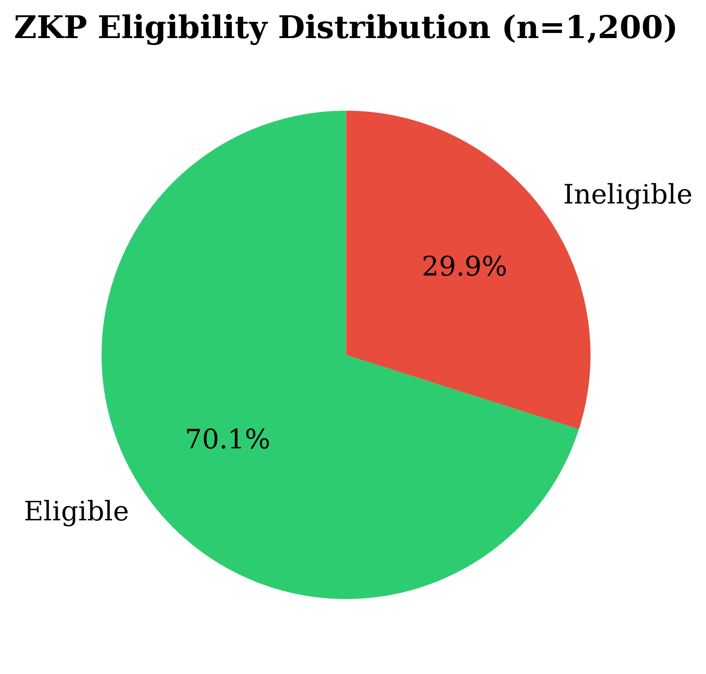 | **Fig 1:** ZKP eligibility distribution across 1,200 samples |
| 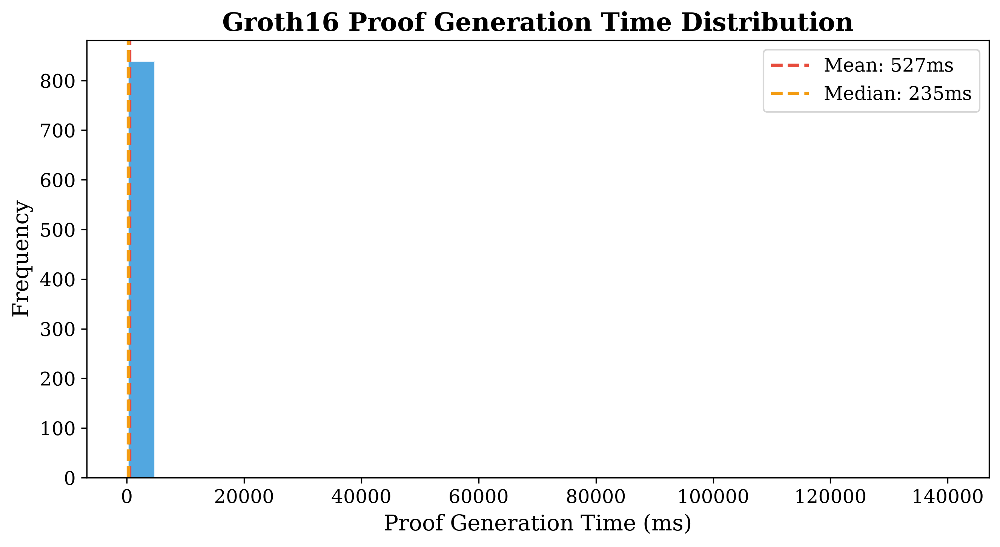 | **Fig 2:** Groth16 proof generation time distribution |
| 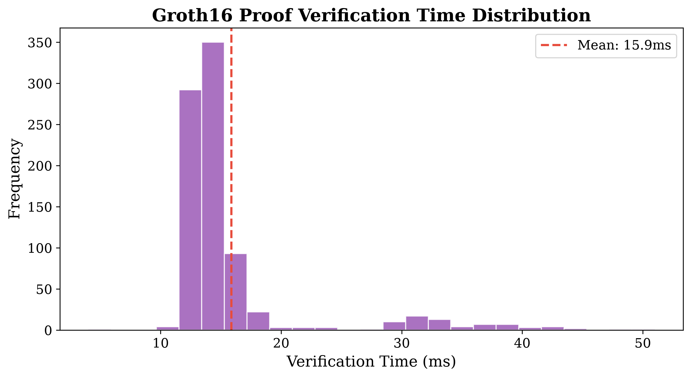 | **Fig 3:** Groth16 proof verification time distribution |
| 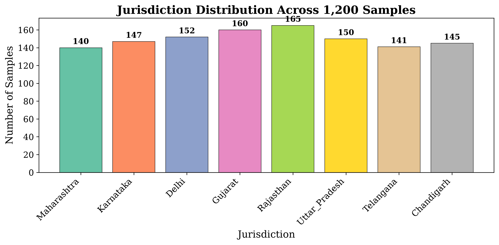 | **Fig 4:** Sample distribution across 8 Indian jurisdictions |
| 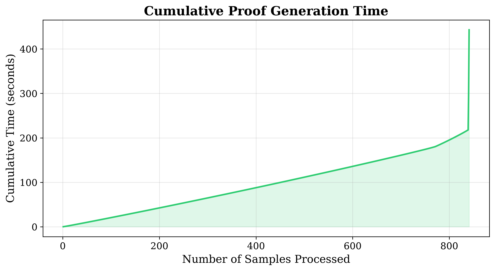 | **Fig 5:** Cumulative proof generation time |
| 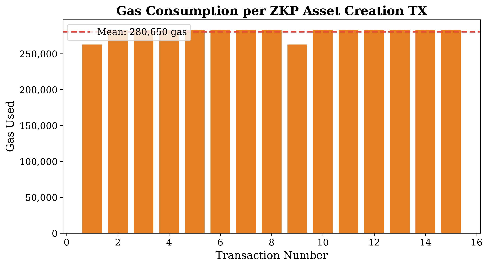 | **Fig 6:** Gas consumption per on-chain transaction |
| 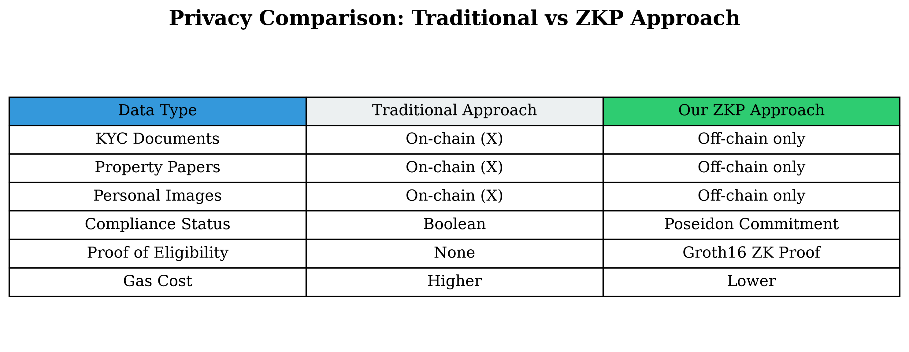 | **Fig 7:** Privacy comparison: Traditional vs ZKP approach |
| 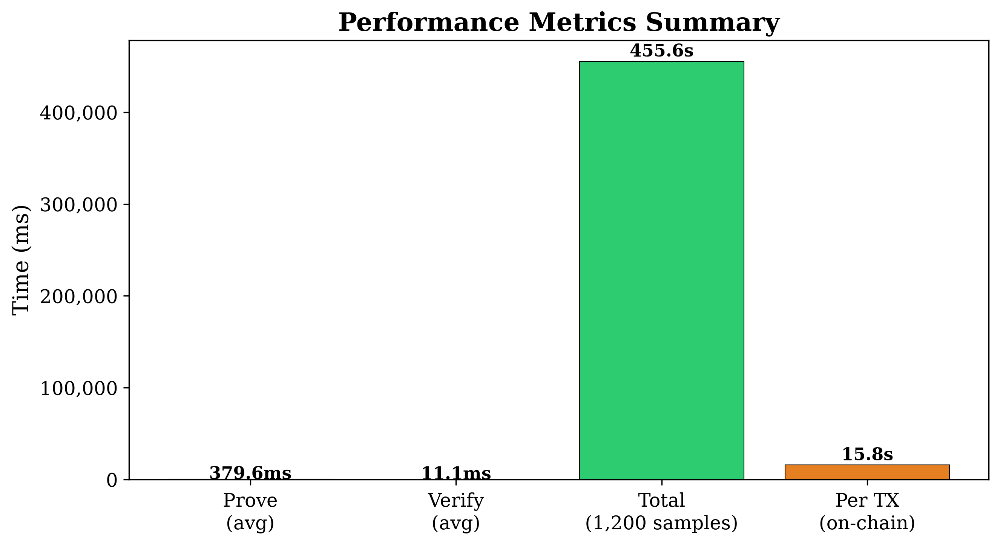 | **Fig 8:** Performance metrics summary |

## Privacy Properties

| Data Type | Traditional (On-Chain) | Our ZKP Approach |
|-----------|------------------------|------------------|
| KYC Documents | Stored on-chain (X) | Off-chain only |
| Property Papers | Stored on-chain (X) | Off-chain only |
| Personal Images | Stored on-chain (X) | Off-chain only |
| Compliance Status | Boolean | Poseidon Commitment |
| Proof of Eligibility | None | Groth16 ZK Proof |
| Gas Cost | Higher (more data) | Lower (minimal data) |

## Screenshots

### 1. Smart Contract on HashScan
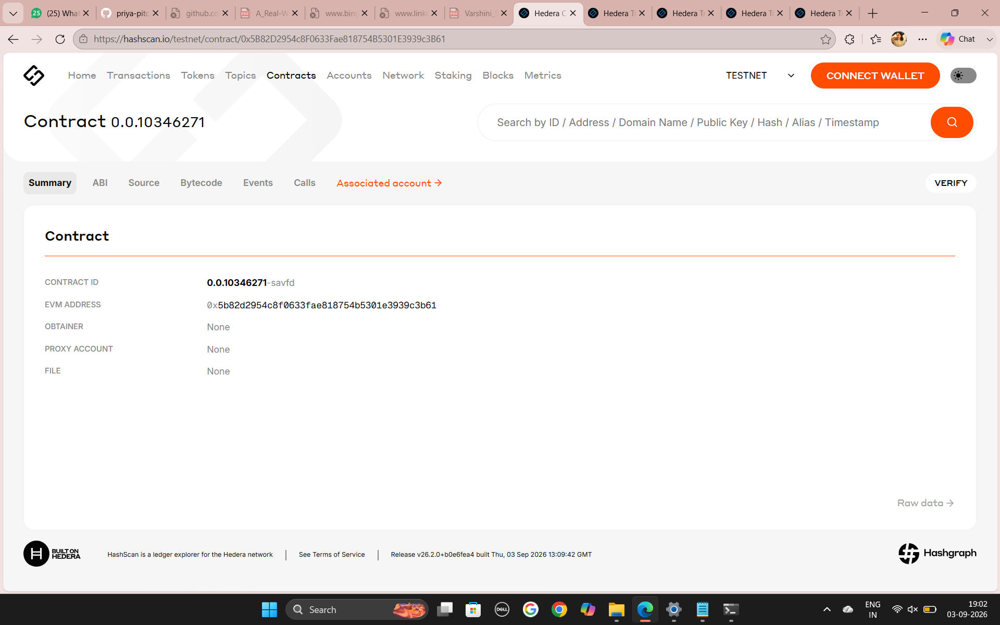
*Contract 0.0.10346271 — SAMKZkpTokenization on Hedera Testnet*

### 2. Contract Deployment Transaction
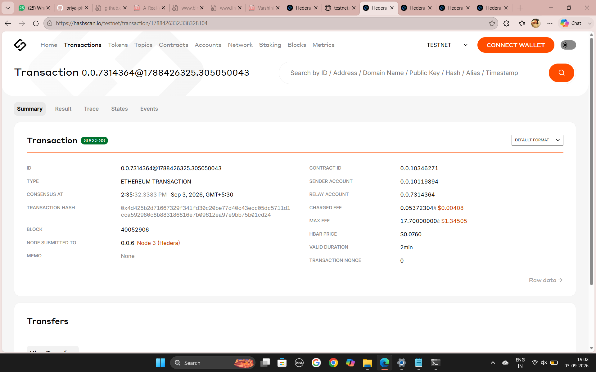
*Deployment TX — Block 40052906, Fee: 0.0537 HBAR*

### 3. First ZKP Asset Creation
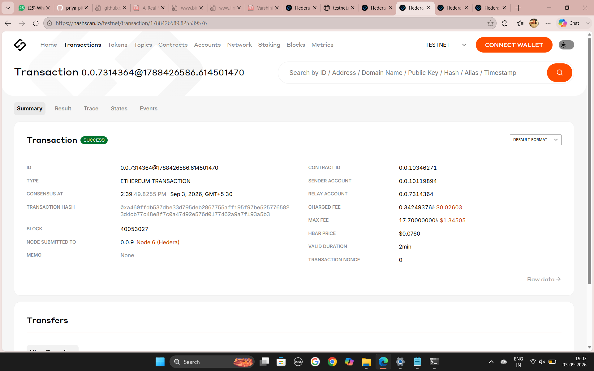
*First asset created with ZKP verification — Block 40053027, Fee: 0.3425 HBAR*

### 4. Second ZKP Asset Creation (PR-00002)
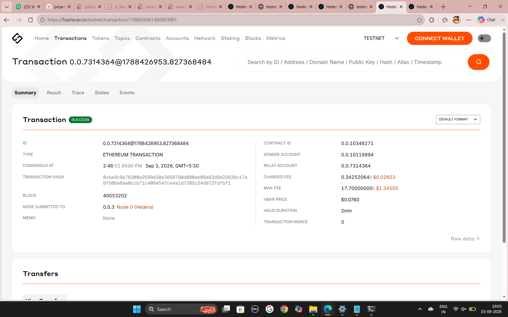
*End-to-end test: ZKP proof verified → Asset PR-00002 created — Block 40053202, Fee: 0.3425 HBAR*

### 5. Batch Submission Transaction
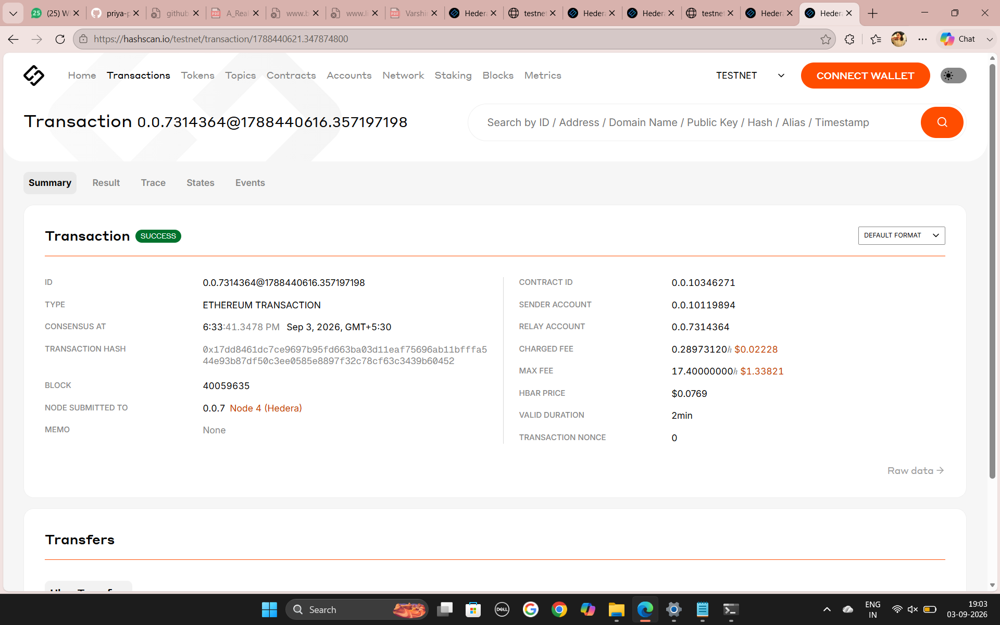
*First batch on-chain submission — Block 40059635, Fee: 0.2897 HBAR*

## Project Structure

```
SAMK_ZKP_Hedera/
├── circuit/
│   └── compliance_samk.circom         # ZK circuit (480 constraints)
├── contracts/
│   └── SAMKZkpTokenization.sol        # ERC-1155 with ZKP gate
├── scripts/
│   ├── compile.js                     # Solidity compiler
│   ├── deployWithEthers.js            # Deploy to Hedera
│   ├── verifyAndOnboard.js            # ZKP verification bridge
│   ├── batchTest.js                   # Batch test (1,200 samples)
│   ├── onchainSample.js               # On-chain submission
│   └── generate_charts.py             # Chart generator
├── build/
│   ├── SAMKZkpTokenization.abi
│   └── SAMKZkpTokenization.bin
├── figures/                           # Generated charts for paper
│   ├── fig1_eligibility_distribution.png
│   ├── fig2_proof_generation_time.png
│   ├── fig3_verification_time.png
│   ├── fig4_jurisdiction_distribution.png
│   ├── fig5_cumulative_time.png
│   ├── fig6_gas_per_tx.png
│   ├── fig7_privacy_comparison.png
│   └── fig8_performance_summary.png
├── batch_output/                      # Raw experiment data
│   ├── batch_results.csv
│   ├── batch_summary.json
│   └── onchain_sample_summary.json
├── docs/
│   ├── METHODOLOGY.md                 # How the system works
│   ├── RESULTS.md                     # All experimental results
│   ├── BATCH_TEST_RESULTS.md          # 1,200 sample results
│   ├── ONCHAIN_RESULTS.md             # 15 TX gas metrics
│   ├── HASHSCAN_LINKS.md              # All transaction links
│   └── screenshots/                   # HashScan screenshots
├── package.json
├── compile.js
├── deployment.json
└── .env.example
```

## How to Run

### Prerequisites
- Node.js 18+
- Hedera testnet account with HBAR
- Python 3.8+ (for chart generation)

### Setup
```bash
npm install
node compile.js
```

### Deploy
```bash
# Configure .env with your Hedera credentials
node scripts/deployWithEthers.js
```

### Create Asset with ZKP
```bash
node scripts/verifyAndOnboard.js PR-00001 proof.json public.json
```

### Run Batch Test
```bash
node scripts/batchTest.js 1200
```

### Generate Charts
```bash
pip install matplotlib pandas
python scripts/generate_charts.py
```

## For Paper

This implementation supports the following research contributions:

1. **Privacy-preserving compliance**: ZKPs prove eligibility without exposing private data
2. **AI + ZKP integration**: Neural network assessment feeds into ZK circuit
3. **Hedera-native tokenization**: ERC-1155 fractional shares with low transaction fees
4. **Practical deployment**: End-to-end working system on public blockchain
5. **Scalability**: 1,200 samples processed with 100% verification accuracy

## License

MIT
